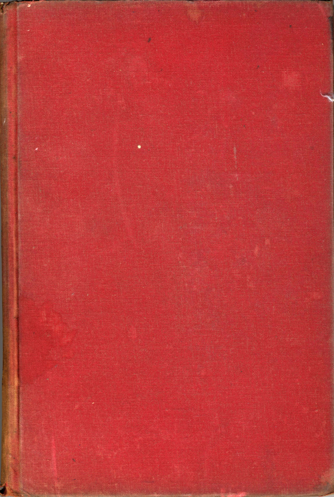

# Quickstart

*Git to book* is an easy way to write to multiple formats using Markdown. It is basically a bridge between pandoc and git. Pandoc is used to generate the different formats, and git repos are used to store the content written in markdown. There is a online version which you can log into. The online version will export to epub, mobi and html. If you install it on your own server you will be able to export to any format supprted by pandoc, e.g. pdf. 

When adding a git URL to the system, the gittobook will checkout the repo, and look for any markdown files (.md). The files found are collected into one document which is then transformed using pandoc. You can browse this documentation on <https://github.com/diversen/git-to-book-docs>

## Example 

## Install

### Requirements

* php5 >= 5.3
* mysql-server
* pandoc
* tex-live

## Howto

## Math

Inline math equations go in like so: $\omega = d\phi / dt$. Display
math should get its own line and be put in in double-dollarsigns:

$$I = \int \rho R^{2} dV$$

$$\forall x \in X, \quad \exists y \leq \epsilon$$

$$\lim_{x \to \infty} \exp(-x) = 0$$

## Syntax highlight

And here's how it looks after syntax highlighting:

~~~~~~~~~~~~~~~~~~~~~~~~~~~~~~~~~~~~~~~~~~ {.haskell}
-- | Inefficient quicksort in haskell.
qsort :: (Enum a) => [a] -> [a]
qsort []     = []
qsort (x:xs) = qsort (filter (< x) xs) ++ [x] ++
               qsort (filter (>= x) xs) 
~~~~~~~~~~~~~~~~~~~~~~~~~~~~~~~~~~~~~~~~~~~~~~~~~~~~

And here's how it looks after syntax highlighting:

~~~{.php}
<?php

echo "hello world";
~~~~

## Footnotes

Here is a footnote reference,[^1] and another.[^longnote]

[^1]: Here is the footnote.

[^longnote]: Here's one with multiple blocks.

    Subsequent paragraphs are indented to show that they
belong to the previous footnote.

        { some.code }

    The whole paragraph can be indented, or just the first
    line.  In this way, multi-paragraph footnotes work like
    multi-paragraph list items.

This paragraph won't be part of the note, because it
isn't indented.

## Build it yourself

